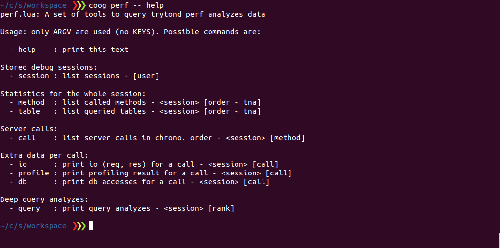
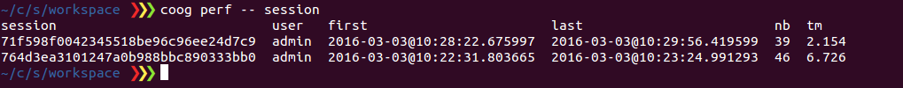
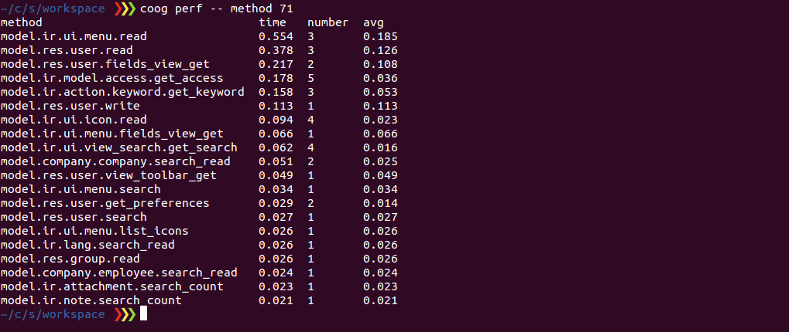
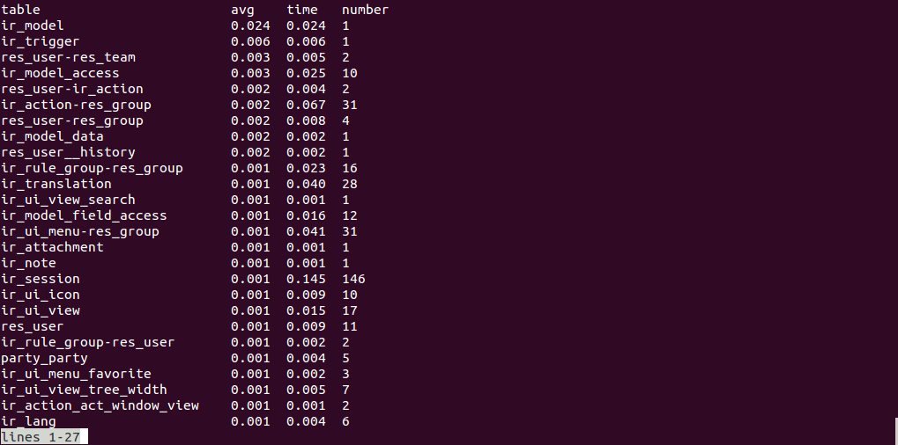
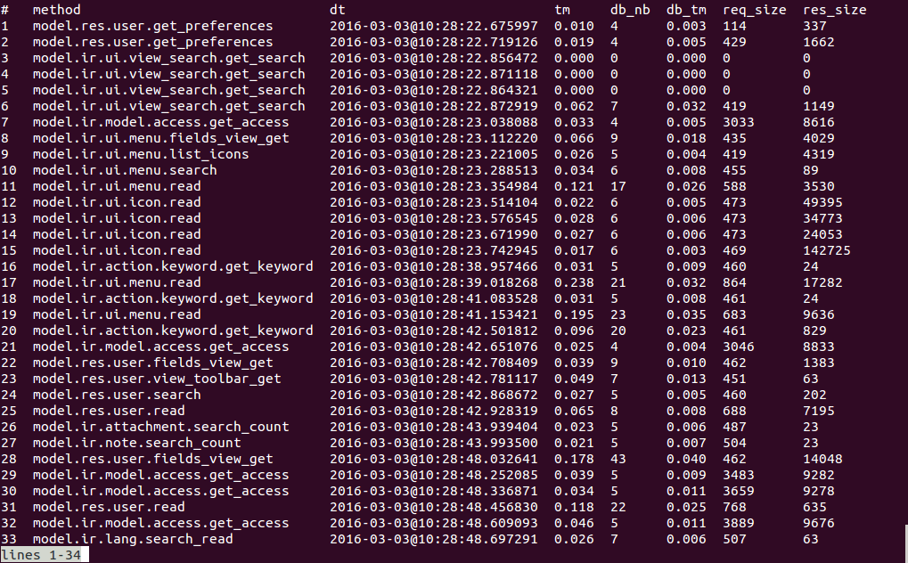
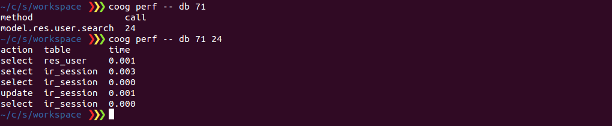
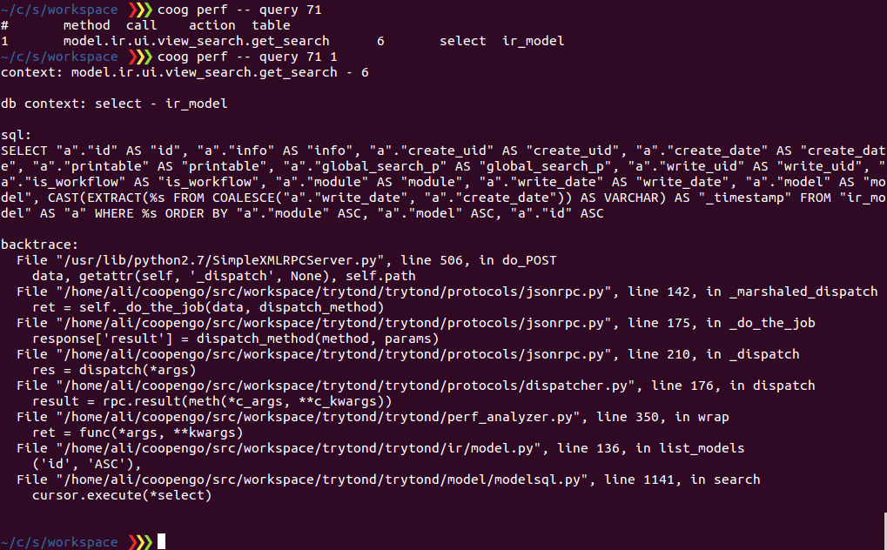

# Tryton Performance Analyzer

This script is a part of a tool-chain that aims to help analyze potential
Tryton performance issues.

## Context

- Tryton is an excellent ERP platform that makes it easy to develop specific
  business processes. It also brings up to one hundred modules ready to use
  (party management, accounting, etc.). More information can be found on the
  [Tryton Foundation Site](http://www.tryton.org/)
- Sometimes, when writing business modules, we may come across unexpected
  performance issues that are usually difficult to understand.
- Since Tryton is a client / server application, it can prove difficult to
  identify the RPC call that causes the problem.
- Even when that call has been identified, it is still hard to debug a call
  (Tryton is a technical framework with many abstractions).
- Tryton client is logic-less, the major part of potential performance issues
  are server side (and precisely on your own mode code).
  tryton-perf-analyzer targets these kind of issues.

## How does it work?

### Main components

- A patched trytond (tryton server) which hooks server calls and logs data to
  be later analyzed
    - Hoping that this is a transitional state until this work is accepted by
      Tryton Foundation.
    - The commit to retrieve is
      [here](https://github.com/coopengo/trytond/commit/ce6d272f22197d690eb3e66ed3941c72e2429b56)
    - A dedicated git branch is created to maintain this piece of code. It is
      safer to get the diff from 3.8 branch
      [here](https://github.com/coopengo/trytond/compare/3.8...perf-analyzer)

- Redis server to store analysis data.

- This Lua script to read data from Redis
    - Usage: `redis-cli --raw -h <host> -p <port> -n <db> --eval <script> , <arguments>`
    - Prettify: `| column -t`
    - Paginate: `| less`

### Steps for usage

- Install [Redis](http://redis.io/)
- Install Python dependencies

    `pip install redis hiredis msgpack-python`

- Apply the patch to your server (trytond)
- Configure (trytond.conf)

    ```
    [perf]
    broker = redis://127.0.0.1:6379/15  # redis url and db
    users = admin                       # users that analyze
    io = model.ir.ui.menu.read          # log io for these methods
    profile = model.res.user.read       # profile methods
    db = model.res.user.search          # log all db accesses for theses methods
    query = 0.2                         # deeply analyse queries > 0.2 seconds
    ```

    *for the users config, it is a good idea to set a specific user.
	This way you can start a perf-analyze session at anytime when connecting
    to this user*

- Launch the application, connect with the debug user
- Execute the application actions that you want to analyse
- Launch the analyzer commands to get guided to your problem source
    - All server calls are logger with interesting information (server time, db
      calls, ...)
    - Stats about method / db tables usages are provided
    - Extra informations for specified methods and queries

## Example

Using the example configuration, this is the result for:
- Open users entrypoint
- Modify a user

Please note that, in the examples, `coog perf` command is used as a wrapper
around `redis-cli` call.

- help command: shows usage help

    

- session command: list sessions, the only argument is app user (if any)

    

- method command: statistics about call methods (rpc) for the whole session.
  Total time, number of calls, and the average call time. The first argument
  (session) is mandatory. The second is the order (could be t for time, n for
  number and a for average. Default is t)

    

- table command: (similar to method)

    

- call command: list all server calls during the session. It takes the session
  as first mandatory argument. The second one is a filter on methods and is
  optional

    

- db command: show all db accesses for the specified methods

    

- profile command: (similar to db)
- io command: (similar to db)

- query command: for long queries, shows sql and backtrace

    

## Known issues

- In some rare cases, we have some duplicated calls (means that the thread based
  storage is not 100% efficient)
